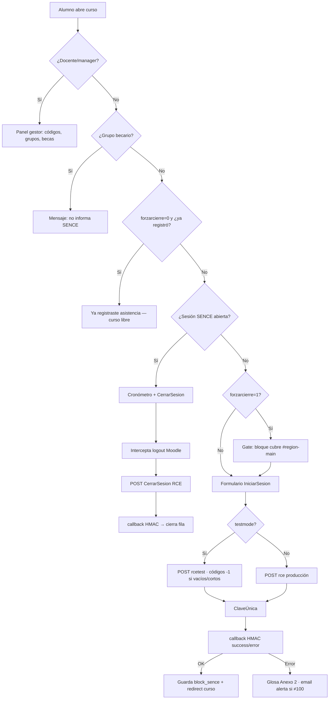

# Moodle SENCE (`block_moodle_sence`)

Bloque **libre (MIT)** para [Registro de Asistencia SENCE](docs/integracion_registro_asistencia_sence_v1.1.6.pdf) (manual técnico v1.1.6).

- **Autor:** [John Rivera](https://github.com/Johnrivera7)
- **Repositorio:** https://github.com/Johnrivera7/moodle_sence
- **Release:** `1.2.0-moodle45`

## Flujo RCE (login / logout)

## Configuración

1. Copiar a `moodle/blocks/moodle_sence/`
2. **Notificaciones** → instalar/actualizar `block_moodle_sence`
3. **Administración → Plugins → Bloques → Registro Asistencia SENCE**
   - RUT OTEC y Token ([RTS SENCE](https://sistemas.sence.cl/rts))
   - Ambiente de prueba (`rcetest`) si corresponde
4. En el curso: agregar bloque **Registro Asistencia SENCE**
5. Ajustes de instancia:
   - Línea de capacitación (1 / 3 / 6)
   - Código: `CodSence/CodigoCurso`, 10 dígitos, o `MULTIPLES`
   - Grupos becarios (coma)
   - Correo alerta, forzar cierre, duración máxima, mensaje de alerta

Al instalar/actualizar, el bloque crea el campo de perfil **RUT** (`shortname=rut` → `profile_field_rut`), **único por usuario**. El RUT del alumno se lee desde ahí (con fallback a `idnumber`/`username`).

### Grupos `SENCE-*`

| Uso | Convención |
|-----|------------|
| ID de acción | Nombre de grupo `SENCE-1234567` (se elige el mayor si hay varios) |
| Alternativa | `idnumber` del grupo numérico o `SENCE-…` |
| `MULTIPLES` | `CodSence` = descripción del grupo (sin HTML) |
| Línea 1 | `CodSence` = espacio ` `; `CodigoCurso` = id de acción del grupo |
| Línea 3/6 | `CodSence` = 1.er segmento del config; `CodigoCurso` = id de grupo o 2.º segmento |

## URLs RCE

| Ambiente | Inicio | Cierre |
|----------|--------|--------|
| Producción | `https://sistemas.sence.cl/rce/Registro/IniciarSesion` | `.../CerrarSesion` |
| Prueba | `https://sistemas.sence.cl/rcetest/Registro/IniciarSesion` | `.../CerrarSesion` |

## Características

| Tema | Detalle |
|------|---------|
| Licencia | MIT — código auditable |
| Credenciales | Settings globales + fallback desde `local_moodle_sicsence` |
| Retorno RCE | `callback.php` firmado HMAC |
| Ambiente prueba | `testmode` → `rcetest` y códigos `-1` |
| Persistencia | Tabla `block_sence` |
| Gate curso | Cubre `#region-main` hasta registrar asistencia |
| Becarios / forzar cierre / glosas | Grupos becarios, cierre obligatorio, glosas Anexo 2 |
| Panel gestor | Visible con `viewhiddenactivities` |

## Ramas Moodle

| Rama | Moodle |
|------|--------|
| `MOODLE_45` | 4.5 LTS |
| `MOODLE_50` | 5.0 |
| `MOODLE_51` | 5.1 |
| `MOODLE_52` | 5.2 |

## Compatibilidad con `local_moodle_sicsence`

Puede reutilizar RUT/token desde `credencialesjson` de SIC. Alinee `CodSence/CodigoCurso` del bloque con `codigoOferta/codigoGrupo` en SIC.

## Licencia

MIT — ver [LICENSE](LICENSE).
